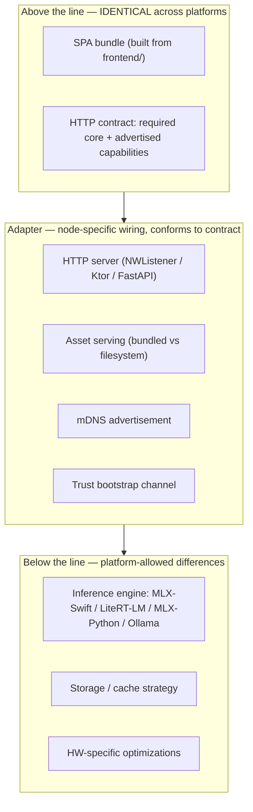
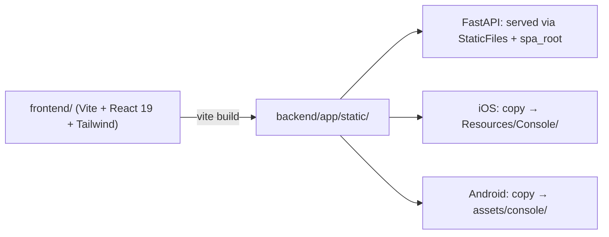

# iHomeNerd — Node Architecture & Cross-Platform Parity

**Status:** Living document — update when parity expectations change.
**Owners:** Claude (principal). Implementations live across `frontend/`, `mobile/ios/`, `mobile/android/`, `backend/`.
**First written:** 2026-05-02. **Revised same day** (v2: reframed from "MUST serve" to "honest advertisement"; added the why-ladder, the demand catalog, the capability anatomy, and the load/scope/reliability fields).

---

## 1. The why ladder

iHomeNerd ships as a **fleet of nodes**: iPhones, Androids, Mac minis, SBCs, x86 Linux hosts. Each serves household devices — TVs, tablets, an unbranded laptop in a hotel, a phone tethered over a flight Wi-Fi — with local AI capabilities. But "fleet of nodes" isn't the deepest reason iHN exists. Walk the chain.

> **Why uniform UI across nodes?** Because a household has many devices and apps wanting AI, and users shouldn't have to learn ten interfaces.
>
> **→ Why one face for many apps?** Because each app implementing its own AI fights the same scarce hardware (GPU, RAM, model state). Ten implementations on one household's hardware is worse than ten apps sharing one fabric.
>
> **→ Why a fabric over parallel implementations?** Because consumer hardware can't satisfy N independent AI demands. **Coordination is what makes local AI feel different from "every app downloads its own model."**
>
> **→ Why a fleet of nodes (not one server)?** Privacy + locality + offline-first + always-on coverage. No single device covers every use case at every time. The phone is mobile, the Mac is plugged in, the SBC is always-on.
>
> **→ Why be honest about *which* node is doing what?** Because that visibility is what makes "local AI" categorically different from cloud AI. **Knowing where your data is being processed *is* the product.**

The contract below exists in service of this chain.

The **N=2 reference deployment** is **ProNunCo** — the founding use case. *Sweet iPhone in hand for drills, cracked-screen Motorola as the brain in the bag.* Already first-class in the codebase: `backend/app/plugins/pronunco.py`, `PronuncoPinyinTools` wired through to Android, capabilities advertised in `/capabilities`. Anything we design must keep working at N=2. If it requires more nodes than that, it's not iHN — it's a cluster product.

---

## 2. The demand pulls the contract

Capabilities exist in the contract because **named first-party apps need them**. Not aspirationally — really.

| App | Capabilities needed | `latency_class` | `scope_class` hint | Notes |
|---|---|---|---|---|
| **ProNunCo** (shipping today) | `compare_pinyin`, `normalize_pinyin`, `transcribe_audio`, `synthesize_speech` | fast | `lan_only` | Founding use case |
| **On-My-Watch** | `image_understand`, `audio_classify` | **fast** | `lan_only` (consent layer above) | Streaming/event detection. "Audio if legal" — wiretap consent is per-jurisdiction |
| **iLegalFlow** | `image_understand` (USPTO drawings), `document_understand` | **deep / thinking** | `lan_only` minimum (privilege) | Patent figures need OCR-within-drawing + structural |
| **iMedisys** | `image_understand`, `audio_understand` (dictation) | **mix** (triage = fast; scan analysis = deep) | **`device_only` or `personal_fleet`** | PHI/HIPAA. Local-only-by-default *is* the product thesis |
| **TecPro-Bro** | `video_understand` (audio + video together) | mixed | varies | Scene/event/transcript merge for technical content |

All apps are first-party Alex projects on GitHub. Source lives on Dell / MSI hosts (not on this Mac mini), so this doc names them but does not link or excerpt code. A separate `docs/APP_CATALOG.md` can hold the index when ready.

**The rule:** when proposing a new capability, name the app(s) that need it. **No app driver = parking lot, not roadmap.** Aspirational capabilities are fine in the parking lot — just don't pollute the contract surface with them.

---

## 3. Capability anatomy & lifecycle

Every capability advertised by a node returns a record like:

```json
{
  "available": true,
  "endpoint": "/v1/image/understand",
  "method": "POST",
  "backend": "mlx_ios",
  "model": "mlx-community/Qwen2-VL-2B-Instruct-4bit",
  "latency_class": "fast",
  "scope_class": "lan_only",
  "current_load": {
    "active_sessions": 0,
    "queue_depth": 0,
    "p50_latency_ms": 380
  },
  "reliability_hint": {
    "success_rate_1h": 1.0,
    "last_cold_start_ms": 4200
  }
}
```

`available`, `endpoint`, `latency_class`, and `backend` exist in `/capabilities` today. `scope_class`, `current_load`, and `reliability_hint` are reserved by v2 of this doc but rolling out per platform — see §9 for the rollout path. The **request/response shape itself is defined in the capability's spec doc** (e.g., `docs/capabilities/<name>.md`), not transmitted in the JSON. Clients learn shapes from spec; they discover availability and tier from `/capabilities`.

### Capability lifecycle (5 steps to add a new one)

1. **Use case identifies the need.** A named app from §2 (or a new app being added to that table) with a concrete user task.
2. **Proposal lands as `docs/capabilities/<name>.md`** — what's it for, who consumes it, why a generic capability beats a one-off.
3. **Shape is ratified before any node implements.** Endpoint path, request/response, error semantics, latency/scope tier expectations. **This is the step that prevents the iOS-vs-Android-`/v1/chat` divergence we're cleaning up.**
4. **First node implements + advertises.** Other nodes show `available: false` until they implement.
5. **SPA / external clients consume by capability name.** Other nodes implement on their own timeline. **Some nodes never will, and that's correct** — an Orange Pi without a VLM is still a valid iHN node.

Step 3 is the tax that keeps the fabric honest. Skipping it is the failure mode this doc is built to prevent.

---

## 4. The honest-advertisement principle

Two layers of "what this node serves":

**Required core** — the only true MUSTs. Three TLS endpoints + one HTTP setup channel = recognizable iHN node:

- `GET /health` — alive + version
- `GET /discover` — identity + advertisement bundle
- `GET /capabilities` — the rest of this section
- Trust bootstrap channel (`:17778/setup/*` on mobile; varies on backend)

**Advertised capabilities** — everything else is opt-in by advertisement. If `/capabilities` says `chat: { available: true, ... }`, you serve `/v1/chat` with the canonical shape and respect your own advertised `latency_class` / `scope_class` / `current_load`. If you don't advertise it, clients won't ask you for it.

**"Honest" means three things:**

1. Don't advertise what you can't reliably do. False `available: true` is worse than missing — clients pick you and fail.
2. Surface load truthfully. A node with five in-flight chat sessions isn't "the same" as one with zero just because both have the same model loaded.
3. **Surface scope truthfully.** A node that opens a cloud fallback for some requests must say so via `scope_class`, even if the LLM happens to be local. Privacy is an end-to-end property, not a per-request choice.

The privacy scope axis is real but its full taxonomy is open (§9 Q1). For v2, two values are usable today:

- `device_only` — never leaves this physical device
- `lan_only` — stays within the home/office LAN; no WAN egress for this capability

Future tiers (`personal_fleet`, `office_fleet`, `integrator_network`, `us_region_cloud`, `public_internet`) get added as iMedisys / iLegalFlow concretely need them.

---

## 5. Layering & current state



### Per-platform state (2026-05-02)

| Platform | HTTP server | SPA serving | Inference engine | Adapter language |
|---|---|---|---|---|
| **Backend** (Linux/macOS host, SBCs, Mac mini brain) | FastAPI + uvicorn | **✅ Present.** `app.mount("/assets", ...)` + `spa_root` route in `backend/app/main.py` | `backend/app/llm.py` provider abstraction (MLX-Python, Ollama) | Python |
| **iOS** (iPhone, iPad) | `mobile/ios/.../NodeRuntime.swift` (Network.framework, NWListener, TLS via Home CA) | **❌ Missing.** 8-line stub `indexHTML` at `/` | `MLXEngine.swift`, `WhisperEngine`, `OCREngine` | Swift |
| **Android** | `mobile/android/.../LocalNodeRuntime.kt` (custom socket server) | **❌ Missing.** Inline `commandCenterHtml()` dashboard, no SPA. Plumbing exists (`serveBundledCommandCenterAsset`) but no assets bundled. | `AndroidChatEngine.kt` (LiteRT-LM), local Whisper variant | Kotlin |

Allowed below-the-line variations (non-exhaustive):

- iOS uses `MLX.Memory.clearCache()` between model swaps (Kimi's recipe at `docs/MLX_MODEL_SWITCH_MEMORY_RECIPE.md`).
- Android uses LiteRT-LM GPU delegate where supported.
- Backend pools model containers across requests in a way mobile cannot.
- Any platform may declare hardware accelerators via `/capabilities` so the SPA hints at quality modes accordingly.

---

## 6. Build & distribution



One source (`frontend/`) → one build (`vite build`) → three transports. Implementation: `scripts/build-frontend.sh` runs `vite build` then mirrors output into iOS Resources and Android assets folders. Manual for now; pre-build phase in Xcode and a Gradle task later.

Per-platform serving:

- **Backend** already serves via `StaticFiles` + `spa_root`.
- **Android**: `serveBundledCommandCenterAsset` plumbing exists — needs assets actually placed in `assets/console/` plus a routing tweak that prefers them over the inline `commandCenterHtml()` fallback.
- **iOS**: new — `NodeRuntime.swift` reads from app bundle's `Console/` and emits MIME types per file extension.

---

## 7. What breaks the fabric

These aren't "forbidden by fiat" — they're things that, if you do them, your node stops being part of the fleet.

- **Per-platform SPA forks.** If iOS bundles a different `index.html` than Android, you're serving a different product on each. Users notice. Consumer apps can't rely on shape.
- **Silent endpoint shape divergence.** The current iOS `/v1/chat` accepting `{prompt}` while Android accepts `{messages}` is the canonical example — same path, different products. Bug, not feature; cleanup is in §8 Phase 2.
- **Lying in `/capabilities`.** A node advertising `available: true` but failing most calls poisons routing for everyone.
- **Hard-coded client knowledge of who serves what.** If the SPA branches by `User-Agent` or hostname instead of by `/capabilities`, the fabric loses its self-organizing property.
- **Privacy advertisement that doesn't match reality.** A node claiming `scope_class: lan_only` but quietly reaching to a cloud API for fallback is the worst violation — it's a trust break, not just a contract break.

---

## 8. Roadmap

**Phase 1 — uniform web UI (this initiative, branch `feature/uniform-web-ui`):**

- [x] Architecture doc v2 (this file)
- [ ] `scripts/build-frontend.sh` build pipeline (Codex)
- [ ] iOS `NodeRuntime.swift` SPA serving (Claude)
- [ ] Android `LocalNodeRuntime.kt` SPA serving + drop the inline `commandCenterHtml()` fallback (Codex)
- [ ] Model-selection panel in `frontend/src/components/` (Qwen — fully-spec'd shape, hits `/v1/models` + `/v1/models/load`)
- [ ] Cross-platform parity test (DeepSeek): same SPA bundle hash served, same `/capabilities` shape, same `/v1/chat` round-trip on iOS/Android/backend

**Phase 2 — contract unification:**

- [ ] iOS `/v1/chat` accepts `{messages}` canonical form (today: only `{prompt}`)
- [ ] Response shape unification — `content` + `text` both present; `role`, `model`, `backend` mandatory
- [ ] `IhnEngineError` taxonomy (Task #1, Qwen's design at `docs/ERROR_TAXONOMY_DESIGN.md`)
- [ ] `/capabilities` v2 fields: `scope_class`, `current_load`, `reliability_hint` added to existing capability records

**Phase 3 — multimodal capability rollout (driven by §2 app demand):**

- [ ] `image_understand` — first node: backend with Llama 3.2 Vision via Ollama (drives iLegalFlow, On-My-Watch fast tier, iMedisys triage)
- [ ] `document_understand` — backend layout-aware extraction (drives iLegalFlow primary)
- [ ] `audio_classify` — fast event detection (drives On-My-Watch)
- [ ] `video_understand` — combined audio+video (drives TecPro-Bro)
- [ ] iOS multimodal — VLM via MLX-Swift when available; otherwise iPhone routes to Mac mini brain by capability advertisement (this is the fabric working as designed)

**Phase 4 — third-platform onboarding:**

- [ ] Orange Pi / SBC profile: reuse FastAPI as adapter (likely; Linux + Python is straightforward)
- [ ] Mac mini brain (Codex's iphone-led setup track): adapter language confirm — reuse FastAPI vs native Swift adapter
- [ ] Document each platform under §5 as it lands

---

## 9. Open questions

1. **Privacy scope taxonomy.** v2 stubs `device_only` + `lan_only`. The full hierarchy (personal-fleet → office-fleet → integrator-network → us-region-cloud → public-internet) needs design once iMedisys / iLegalFlow concretely need a tier. Open: is "scope" enough, or do we also need orthogonal axes (audit-required, no-telemetry, retention-limit)?
2. **Routing decision: where does it happen?** Three options:
   - **SPA-side**: SPA knows the node list, picks per-request. Stateless servers; SPA needs node list.
   - **Controller-node**: one node dispatches to workers. Single URL for SPA; SPO failure mode if controller dies.
   - **mDNS-driven self-organization**: any node accepts any request, reroutes if it can't handle. No controller; complex to debug.

   Initial lean: **SPA-side for now, mDNS at scale, controller is a trap** — but worth confirming before Phase 1 implementation locks it in.
3. **`current_load` shape & refresh cadence.** Active sessions + queue + p50 latency is the sketch. How fresh — on every `/capabilities` GET? Pushed via SSE? Initial answer: per-GET, with a `stale_after_seconds` hint so clients can re-fetch.
4. **Audio capture consent for On-My-Watch.** "If legal" is jurisdiction-specific. The capability `audio_classify` exists technically; the consent layer above it (who can record, retention, parental permissions for kids' content) is product/policy, not contract. Where does that doc live?
5. **Versioning the SPA.** Should `/health` advertise the SPA bundle hash so a client can detect a stale node? Useful for "is this iPhone serving an old build?" debugging during rollout.
6. **`/setup/mac` (iPhone-only) belongs where?** Today it's iOS-only. Per the doctrine "no client-side hard-coded knowledge of who serves what", should it be a `/capabilities` flag like `mac_setup_concierge: true` that only iPhones advertise?

---

## 10. Operating principle for copilots working under this doc

When a copilot is briefed on a slice of this initiative, the brief cites this doc. The fence is **whatever is consistent with the contract here**. If a copilot wants to deviate — for instance, to add a capability not in the §2 demand catalog, or to change a contract shape — the answer is: **update *this doc* first** (with reasoning grounded in §2 demand), get review, then implement.

Implementation that contradicts the doc is rejected even if it works locally. The doc is the fence. The branch is just where the work lands.
