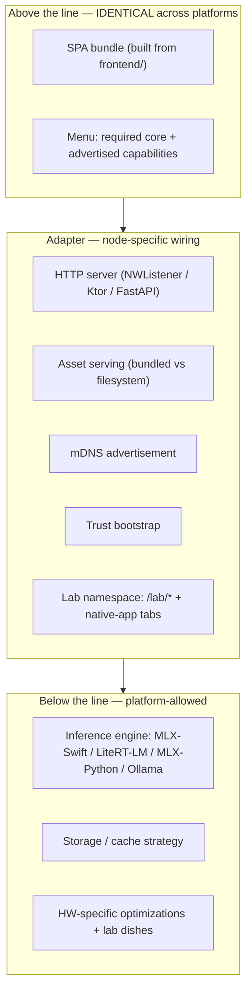
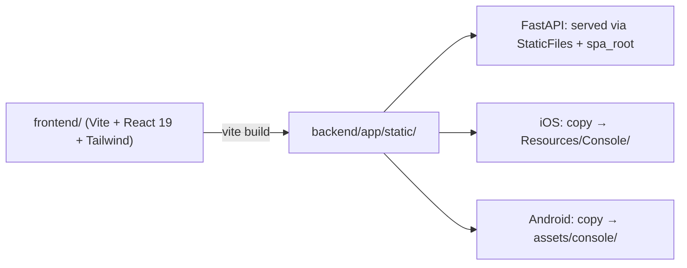

# iHomeNerd — Node Architecture & Cross-Platform Parity

**Status:** Living document — update when parity expectations change.
**Owners:** Claude (principal). Implementations live across `frontend/`, `mobile/ios/`, `mobile/android/`, `backend/`.
**First written:** 2026-05-02. **Revised twice same day** — v2: honest-advertisement + demand-pull catalog. **v3: menu vs lab — the restaurant where every chef also cooks for the family.**

---

## 1. The why ladder

iHomeNerd ships as a **fleet of nodes**: iPhones, Androids, Mac minis, SBCs, x86 Linux hosts. Each serves household devices — TVs, tablets, an unbranded laptop in a hotel, a phone tethered over a flight Wi-Fi — with local AI capabilities. But "fleet of nodes" isn't the deepest reason iHN exists. Walk the chain.

> **Why uniform UI across nodes?** Because a household has many devices and apps wanting AI, and users shouldn't have to learn ten interfaces.
>
> **→ Why one face for many apps?** Because each app implementing its own AI fights the same scarce hardware (GPU, RAM, model state). Ten implementations on one household's hardware is worse than ten apps sharing one fabric.
>
> **→ Why a fabric over parallel implementations?** Because consumer hardware can't satisfy N independent AI demands. **Coordination is what makes local AI feel different from "every app downloads its own model."**
>
> **→ Why a fleet of nodes (not one server)?** Privacy + locality + offline-first + always-on coverage. No single device covers every use case at every time. The phone is mobile, the Mac is plugged in, the SBC is always-on.
>
> **→ Why be honest about *which* node is doing what?** Because that visibility is what makes "local AI" categorically different from cloud AI. **Knowing where your data is being processed *is* the product.**

The contract below exists in service of this chain.

The **N=2 reference deployment** is **ProNunCo** — the founding use case. *Sweet iPhone in hand for drills, cracked-screen Motorola as the brain in the bag.* Already first-class in the codebase: `backend/app/plugins/pronunco.py`, `PronuncoPinyinTools` wired through to Android, capabilities advertised in `/capabilities`. Anything we design must keep working at N=2. If it requires more nodes than that, it's not iHN — it's a cluster product.

---

## 2. Two surfaces: the menu and the lab

A chef in a restaurant cooks two ways. There's the **menu** — dishes diners can order, predictable shape, repeatable, the agreement with anyone who walks in. And there's the **family kitchen** — where the chef dusts off grandma's cracked cast iron and shows off what the hardware can really do for known company. People fly Vancouver to Louisiana for the family kitchen, not the menu.

Every iHN node has both surfaces, and **both are first-class**.

**The menu** is what a node promises to serve to *strangers*: a hotel tablet that just joined the LAN, a third-party app, the cross-platform parity test. Stable shapes, ratified lifecycle, predictable load + scope honesty. Lives at `/v1/*` HTTP routes. Advertised in `/capabilities`. Everything in §3–§5 is about the menu.

**The lab** is what a node does for *itself and known company*: experimental MLX-Swift quantizations, a Pixel-only LiteRT-LM GPU delegate trick, an iOS native tab that visualizes live MLX memory pool, an SBC running a one-off local fine-tune. **Bound by no contract.** Lives at `/lab/*` HTTP routes (gated to trusted personal-fleet nodes) and in the native app's per-platform UI tabs. Not advertised in `/capabilities` to outside callers.

**This distinction is already half-built in our codebase.** The iOS app's `Speak`, `Listen`, `Models`, `Chat` tabs are lab content — platform-specific, not in the web SPA, *correctly* not in the web SPA. Android's Compose UI does the same on its side. v3 names what's already happening so the doctrine stops accidentally implying it's a gap.

### Suggested restaurant-style naming for per-platform lab areas

Each node's lab can pick a specials-board name that fits its platform identity:

- **Mac Brain specialties** — Mac mini / Mac Studio / iMac
- **iOS favorites** — iPhone / iPad
- **Cracked-screen Moto bests** *(try while it lasts)* — Android nodes
- **SBC garden picks** — Orange Pi / Raspberry Pi / future
- **Linux house pours** — x86 backend

Tone: house-special, ephemeral when needed, celebratory of the hardware. Not enterprise-speak.

### Stability promise

- **Menu items**: stable shape, contract-versioned, deprecated with notice, expected to keep working.
- **Lab dishes**: no SLA. May disappear when the chef moves on. May break when iOS / MLX-Swift / etc. updates. May only work while a particular hardware quirk holds. **"Try while it lasts" is part of the offer.**

This is *good*: a lab without freedom-to-fail is just a worse menu. The whole point is some experiments don't graduate, and that's fine.

### From lab to menu — the migration path

A trick that proves out in the lab can become a menu item via §4's lifecycle:

> **Step 0 — lab origin** *(common but optional)*: a chef notices "this MLX-Swift trick consistently saves 40% memory on quantized 2B models" or "this Pixel GPU delegate is reliably 3× faster than the CPU path."
>
> Then the §4 5-step process kicks in: name it → propose it → ratify shape → first node implements → others follow on their own pace.

The lab feeds the menu over time. Conformance isn't the death of innovation; it's how innovation graduates.

### Lab visibility *between trusted nodes*

A node may want to expose its lab to other nodes in the same `personal_fleet` — e.g., my iPhone offering lab features to my Mac Brain so the brain can call them when I'm holding the phone. Mechanism: an optional `GET /lab/menu` introspection endpoint that returns lab routes available to the caller, gated by the caller's authenticated `scope_class`. A hotel-tablet SPA gets nothing. A Mac Brain authenticated into the same fleet gets the listing.

This is the "family gathering" semantics literally: the family table can see what's bubbling on grandma's stove; the diners in the dining room cannot.

---

## 3. The menu: demand pulls what we serve

Menu items exist because **named first-party apps need them**. Not aspirationally — really.

| App | Menu items needed | `latency_class` | `scope_class` hint | Notes |
|---|---|---|---|---|
| **ProNunCo** (shipping today) | `compare_pinyin`, `normalize_pinyin`, `transcribe_audio`, `synthesize_speech` | fast | `lan_only` | Founding use case |
| **On-My-Watch** | `image_understand`, `audio_classify` | **fast** | `lan_only` (consent layer above) | Streaming/event detection |
| **iLegalFlow** | `image_understand` (USPTO drawings), `document_understand` | **deep / thinking** | `lan_only` minimum (privilege) | Patent figures need OCR-within-drawing + structural |
| **iMedisys** | `image_understand`, `audio_understand` (dictation) | **mix** (triage = fast; scan = deep) | **`device_only` or `personal_fleet`** | PHI/HIPAA. Local-only-by-default *is* the product thesis |
| **TecPro-Bro** | `video_understand` | mixed | varies | Audio + video together for technical content |

All apps are first-party Alex projects on GitHub. Source lives on Dell / MSI hosts (not on this Mac mini).

**The rule:** when proposing a new menu item, name the app(s) that need it. **No app driver = parking lot, not roadmap.** Lab dishes don't need a named app driver — that's part of why the lab exists. But **menu items always do**.

---

## 4. Menu item anatomy & lifecycle

Every menu item advertised by a node returns a record like:

```json
{
  "available": true,
  "endpoint": "/v1/image/understand",
  "method": "POST",
  "backend": "mlx_ios",
  "model": "mlx-community/Qwen2-VL-2B-Instruct-4bit",
  "latency_class": "fast",
  "scope_class": "lan_only",
  "current_load": {
    "active_sessions": 0,
    "queue_depth": 0,
    "p50_latency_ms": 380
  },
  "reliability_hint": {
    "success_rate_1h": 1.0,
    "last_cold_start_ms": 4200
  }
}
```

`available`, `endpoint`, `latency_class`, and `backend` exist in `/capabilities` today. `scope_class`, `current_load`, and `reliability_hint` are reserved by this doc and rolling out per platform — see §10 Q1, Q3 for the path. **Request/response shape is defined in the menu item's spec doc** (e.g., `docs/capabilities/<name>.md`), not transmitted in JSON. Clients learn shape from spec; they discover availability and tier from `/capabilities`.

### Lifecycle — 5 ratified steps + the lab origin

0. **Lab origin** *(optional but common)* — discovered while a chef was cooking for family. Hardware or software trick worth promoting.
1. **Use case identifies the need.** A named app from §3 (or a new app being added to that table) with a concrete user task.
2. **Proposal lands as `docs/capabilities/<name>.md`** — what's it for, who consumes it, why a generic menu item beats a one-off.
3. **Shape is ratified before any node implements.** Endpoint path, request/response, error semantics, latency/scope tier expectations. **This is the step that prevents the iOS-vs-Android-`/v1/chat` divergence we're cleaning up.**
4. **First node implements + advertises.** Other nodes show `available: false` until they implement.
5. **SPA / external clients consume by capability name.** Other nodes implement on their own timeline. **Some nodes never will, and that's correct** — an Orange Pi without a VLM is still a valid iHN node, just one with a different specialty.

Step 3 is the tax that keeps the menu honest. Skipping it is the failure mode this doc is built to prevent.

---

## 5. The honest-advertisement principle (menu only)

Two layers of "what this node serves *on the menu*":

**Required core** — the only true MUSTs. Three TLS endpoints + one HTTP setup channel = recognizable iHN node:

- `GET /health` — alive + version
- `GET /discover` — identity + advertisement bundle
- `GET /capabilities` — what this node advertises (everything in §4)
- Trust bootstrap channel (`:17778/setup/*` on mobile; varies on backend)

**Advertised menu items** — everything else is opt-in by advertisement. If `/capabilities` says `chat: { available: true, ... }`, you serve `/v1/chat` with the canonical shape and respect your own advertised tiers. If you don't advertise it, clients won't ask you for it.

**"Honest" means three things:**

1. Don't advertise what you can't reliably do. False `available: true` is worse than missing — clients pick you and fail.
2. Surface load truthfully. A node with five in-flight chat sessions isn't "the same" as one with zero just because both have the same model loaded.
3. **Surface scope truthfully.** A node that opens a cloud fallback for some requests must say so via `scope_class`, even if the LLM happens to be local. Privacy is an end-to-end property, not a per-request choice.

The lab surface (§2) has no honest-advertisement requirement to outside callers because it isn't advertised to them at all. Among trusted personal-fleet nodes that have negotiated `/lab/menu` introspection, lab dishes do still need to be honest about what they actually do — but the contract is much looser ("here's what's bubbling, dish names may not be stable").

Privacy scope axis values (initial; see §10 Q1):

- `device_only` — never leaves this physical device
- `lan_only` — stays within the home/office LAN; no WAN egress for this capability

Future tiers (`personal_fleet`, `office_fleet`, `integrator_network`, `us_region_cloud`, `public_internet`) get added as iMedisys / iLegalFlow concretely need them.

---

## 6. Layering & current state



The lab spans the adapter and below-the-line layers — its HTTP routes live in the adapter, but the unconstrained hardware tricks live below the line.

### Per-platform state (2026-05-02)

| Platform | HTTP server | Menu surface (SPA + `/v1/*`) | Lab surface (`/lab/*` + native UI) | Inference engine | Adapter language |
|---|---|---|---|---|---|
| **Backend** (Linux/macOS, SBCs, Mac mini brain) | FastAPI + uvicorn | **✅ Menu present.** SPA at `/`, `/v1/*` advertised | Not formalized; could become **Linux house pours** once experimental routes appear | `backend/app/llm.py` provider abstraction (MLX-Python, Ollama) | Python |
| **iOS** (iPhone, iPad) | `mobile/ios/.../NodeRuntime.swift` (Network.framework, NWListener, TLS) | **❌ Menu missing on web side.** 8-line stub at `/`. `/v1/*` works | **✅ Lab existing as iOS favorites:** `Speak`, `Listen`, `Models`, `Chat` tabs are platform-specific lab content | `MLXEngine.swift`, `WhisperEngine`, `OCREngine` | Swift |
| **Android** | `mobile/android/.../LocalNodeRuntime.kt` (custom socket server) | **❌ Menu missing on web side.** Inline `commandCenterHtml()` dashboard. `/v1/*` works | **✅ Lab existing as Cracked-screen Moto bests:** Compose-only tabs; the `commandCenterHtml` is itself currently lab-tier and may graduate to `/lab/dashboard` | `AndroidChatEngine.kt` (LiteRT-LM), local Whisper variant | Kotlin |

Allowed below-the-line variations and lab dishes (non-exhaustive):

- iOS `MLX.Memory.clearCache()` recipe between model swaps (Kimi's, `docs/MLX_MODEL_SWITCH_MEMORY_RECIPE.md`)
- Android LiteRT-LM GPU delegate experiments
- Backend pooling model containers across requests in ways mobile cannot
- Per-platform hardware-accelerator hints surfaced via `/capabilities` so the SPA hints quality modes
- Anything a platform wants to put behind `/lab/*` that doesn't belong on the menu yet

---

## 7. Build & distribution (menu surface)



One source (`frontend/`) → one build (`vite build`) → three transports. Implementation: `scripts/build-frontend.sh` runs `vite build` then mirrors output into iOS Resources and Android assets folders. Manual for now; Xcode pre-build phase and a Gradle task later.

Per-platform serving:

- **Backend** already serves via `StaticFiles` + `spa_root`.
- **Android**: `serveBundledCommandCenterAsset` plumbing exists — needs assets actually placed in `assets/console/` plus a routing tweak that prefers them over the inline `commandCenterHtml()` fallback.
- **iOS**: new — `NodeRuntime.swift` reads from app bundle's `Console/` and emits MIME types per file extension.

Lab content does **not** flow through this pipeline. Each platform's lab surface is local to its repo (Swift in iOS, Kotlin in Android, Python in backend) and intentionally divergent.

---

## 8. What breaks the menu

Rules below apply to the **menu surface only**. The lab is exempt — that's the whole point. These aren't "forbidden by fiat"; they're things that, if you do them, your *menu* stops being part of the fleet.

- **Per-platform SPA forks.** If iOS bundles a different `index.html` than Android, you're serving a different product on each. Users notice. Consumer apps can't rely on shape.
- **Silent menu-item shape divergence.** The current iOS `/v1/chat` accepting `{prompt}` while Android accepts `{messages}` is the canonical example — same path, different products. Bug, not feature; cleanup is in §9 Phase 2.
- **Lying in `/capabilities`.** A node advertising `available: true` but failing most calls poisons routing for everyone.
- **Hard-coded client knowledge of who serves what.** If the SPA branches by `User-Agent` or hostname instead of by `/capabilities`, the fabric loses its self-organizing property.
- **Privacy advertisement that doesn't match reality.** A node claiming `scope_class: lan_only` but quietly reaching to a cloud API for fallback is the worst violation — it's a trust break, not just a contract break.

What's **not** on this list (and is fine, even encouraged):

- Native-app UIs that are wildly different across platforms.
- Lab routes (`/lab/*`) that exist on one node and not another.
- Hardware-specific demos in the iOS `Speak` / `Listen` / `Models` tabs that don't appear in the web SPA.
- Restaurant-themed lab area names that vary by platform.
- Lab dishes appearing and disappearing as the chef cooks.

---

## 9. Roadmap

**Phase 1 — uniform menu web UI (this initiative, branch `feature/uniform-web-ui`):**

- [x] Architecture doc v3 (this file)
- [ ] `scripts/build-frontend.sh` build pipeline (Codex)
- [ ] iOS `NodeRuntime.swift` SPA serving (Claude)
- [ ] Android `LocalNodeRuntime.kt` SPA serving + decide whether the inline `commandCenterHtml()` becomes `/lab/dashboard` or is removed (Codex)
- [ ] Model-selection panel in `frontend/src/components/` (Qwen — fully-spec'd shape, hits `/v1/models` + `/v1/models/load`)
- [ ] Cross-platform parity test (DeepSeek): same SPA bundle hash served, same `/capabilities` shape, same `/v1/chat` round-trip on iOS/Android/backend

**Phase 2 — menu shape unification:**

- [ ] iOS `/v1/chat` accepts `{messages}` canonical form (today: only `{prompt}`)
- [ ] Response shape unification — `content` + `text` both present; `role`, `model`, `backend` mandatory
- [ ] `IhnEngineError` taxonomy (Task #1, Qwen's design at `docs/ERROR_TAXONOMY_DESIGN.md`)
- [ ] `/capabilities` v2 fields: `scope_class`, `current_load`, `reliability_hint` added to existing capability records

**Phase 3 — multimodal menu rollout (driven by §3 app demand):**

Each item lists which app drives it and the natural lab-origin node (where it's likely to be cooked first):

- [ ] `image_understand` — drives iLegalFlow, On-My-Watch fast tier, iMedisys triage. **Lab origin: backend Mac mini brain** (free GPU + big VRAM); iOS lab origin once a 4–6 GB-fittable VLM is pickable in MLX-Swift.
- [ ] `document_understand` — drives iLegalFlow primary. **Lab origin: backend** layout-aware extraction.
- [ ] `audio_classify` — drives On-My-Watch. **Lab origin: iOS** for fast on-stream event detection.
- [ ] `video_understand` — drives TecPro-Bro. **Lab origin: backend** with combined audio+video pipeline.
- [ ] iOS multimodal — fast-tier VLM via MLX-Swift when available; otherwise iPhone routes to Mac Brain by capability advertisement. The fabric working as designed.

**Phase 4 — third-platform onboarding:**

- [ ] Orange Pi / SBC profile: reuse FastAPI as adapter (likely; Linux + Python is straightforward); pick a "garden picks" lab style.
- [ ] Mac mini brain (Codex's iphone-led setup track): adapter language confirm — reuse FastAPI vs native Swift adapter.
- [ ] Document each platform under §6 as it lands.

---

## 10. Open questions

1. **Privacy scope taxonomy.** v3 stubs `device_only` + `lan_only`. The full hierarchy (`personal_fleet` → `office_fleet` → `integrator_network` → `us_region_cloud` → `public_internet`) needs design once iMedisys / iLegalFlow concretely need a tier. Open: is "scope" enough, or do we also need orthogonal axes (audit-required, no-telemetry, retention-limit)?
2. **Routing decision: where does it happen?** Three options:
   - **SPA-side**: SPA knows the node list, picks per-request. Stateless servers; SPA needs node list.
   - **Controller-node**: one node dispatches to workers. Single URL; SPO failure mode.
   - **mDNS-driven self-organization**: any node accepts any request, reroutes if it can't. No controller; complex to debug.

   Initial lean: **SPA-side for now, mDNS at scale, controller is a trap.**
3. **`current_load` shape & refresh cadence.** Active sessions + queue + p50 latency is the sketch. Per-`/capabilities` GET, with a `stale_after_seconds` hint; reconsider if SSE turns out cheaper.
4. **Audio capture consent for On-My-Watch.** "If legal" is jurisdiction-specific. The `audio_classify` capability exists technically; the consent layer above it (recording permissions, retention, parental settings) is product/policy. Where does that doc live?
5. **Versioning the SPA.** Should `/health` advertise the SPA bundle hash so a client can detect a stale node? Useful for "is this iPhone serving an old build?" debugging.
6. **`/setup/mac` (iPhone-only) belongs where?** Today it's iOS-only. Per "no client-side hard-coded knowledge of who serves what", should it become a `/capabilities` flag like `mac_setup_concierge: true` that only iPhones advertise? Or is it lab-tier (an iOS favorite that just happens to be HTTP-callable rather than native-only)?
7. **Lab introspection & trust gating.** Mechanism for the optional `GET /lab/menu` endpoint that exposes lab dishes between trusted personal-fleet nodes. Auth model — same Home CA + caller `scope_class`? Out of band entirely?

---

## 11. Operating principle for copilots working under this doc

When a copilot is briefed on a slice of this initiative, the brief cites this doc. **The fence is whatever is consistent with the menu-side contract here.** Lab work has no fence beyond "doesn't break the menu" — copilots working on platform-specific lab dishes are encouraged to take the cuffs off. Show off what the hardware can really do.

If a copilot wants to deviate from the menu — for instance, add a capability not in the §3 demand catalog, or change an existing menu shape — the answer is: **update *this doc* first** (with reasoning grounded in §3 demand), get review, then implement.

Implementation that contradicts the menu is rejected even if it works locally. The menu is the fence. The branch is just where the work lands. The lab is where you go cook for family.
